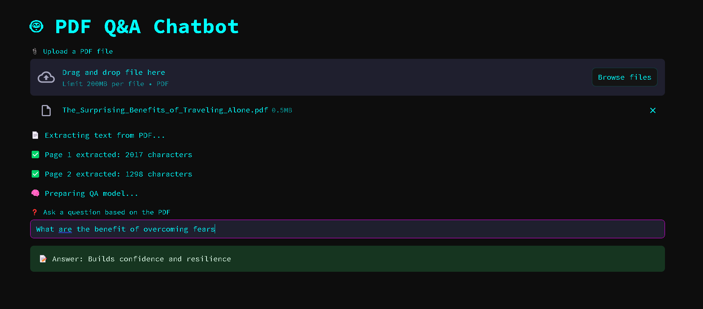

# ⚡ NeonMind: AI Chatbot Terminal 🤖🧠

> _"An intelligent assistant born in the data haze of the cyber grid."_

Welcome to **NeonMind**, your personal AI assistant built using open-source LLMs, local embeddings, and a cyberpunk-inspired Streamlit interface. Ask questions. Get answers. All on your machine. No OpenAI key required.

---

## 🖼️ Preview



---

## 🚀 Features

- 💬 Chat-based QA with your own documents (PDF, text, etc.)
- 🧠 Uses open-source LLMs and local embeddings (e.g., BGE, Instructor-XL, etc.)
- 🔍 PDF parsing and context-aware question answering
- ⚡ Fast local vector search using FAISS
- 🖤 Fully themed with a cyberpunk UI (neon + dark mode)
- 🔐 No external API calls — everything runs locally

---

## 🛠️ Tech Stack

| Tool | Purpose |
|------|---------|
| **Streamlit** | UI & Dashboard |
| **LangChain** | LLM orchestration |
| **FAISS** | Vector store for fast document search |
| **SentenceTransformers** | Text embedding |
| **HuggingFace Models** | Local LLMs & embeddings |
| **PyMuPDF / pdfplumber** | PDF parsing |

---

## 🧩 Installation

> 🔧 Prerequisites: Python 3.10+, 16GB RAM, GPU with at least 4GB VRAM (e.g., GTX 1650)

```bash
git clone https://github.com/your-username/neonmind-chatbot
cd neonmind-chatbot

# Create a virtual environment
python -m venv venv
venv\Scripts\activate  # or source venv/bin/activate (Mac/Linux)

# Install dependencies
pip install -r requirements.txt
